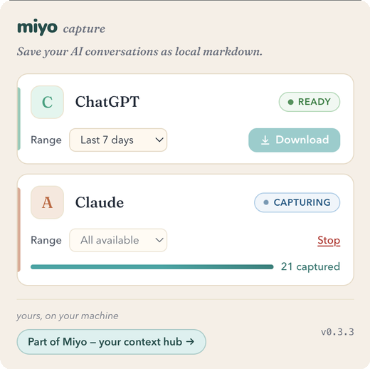

# Miyo Capture

> Capture your AI chats as markdown. Yours, on your machine.

A browser extension that turns your **ChatGPT** and **Claude**
conversations into markdown files. No accounts, no servers in the
cloud, no telemetry.

Pick a time range, click **Download**, and the extension fetches the
matching conversations and hands you a single ZIP of markdown files —
one conversation per file — straight to your Downloads folder.

The output is plain markdown — open it in **Obsidian**, **Logseq**,
your editor, or `grep`. Nothing locks you in.

<p align="center">
  
</p>

## Install

- **Browser extension store** — *coming soon.*
- **From a release artifact** — grab the latest
  `miyo-capture-<version>-chrome.zip` from
  [Releases](https://github.com/Brevilabs/miyo-extension/releases),
  unzip it, then in `chrome://extensions` enable Developer mode
  and click **Load unpacked** on the unzipped folder.

## How it works

1. Open the popup. You'll see one card per supported site
   (ChatGPT, Claude).
2. Sign in to the site in a tab (if you aren't already).
3. Pick a time range (last 7 days, 30 days, all available, or a
   custom window).
4. Click **Download** to get a ZIP of the matching conversations.

## What's captured

- **ChatGPT** — full conversation history (titles, timestamps,
  messages).
- **Claude (claude.ai)** — full conversation history.

More sources are planned. Each is a single adapter file — see
[docs/ADAPTER-API.md](docs/ADAPTER-API.md).

## Design

- **Sync only when you click.** No background polling, no alarms,
  no service-worker timers. Every fetch is a direct consequence of
  you pressing Download.
- **Local only.** Conversation data goes straight to your Downloads
  folder. It never leaves your machine.
- **Zero runtime dependencies, zero telemetry.** The extension
  ships no analytics and no feedback pings.
- **Resume after interruption.** If the browser kills the worker
  mid-run, the next popup open offers Resume from the same cursor —
  useful for large histories.
- **No lock-in.** The output is plain markdown. Any tool that
  reads files can consume it.

## From the makers of Miyo

Miyo Capture is made by [Miyo](https://www.miyo.md/), your personal
context hub. The conversations you export here can become part of a
local, searchable memory that any AI can use — so ChatGPT can pick up
what you told Claude yesterday, and vice versa. Miyo Desktop keeps
everything as plain files on your own computer (no cloud uploads) and
connects to ChatGPT and Claude over MCP. It's a separate, optional,
free app — [make it your own](https://www.miyo.md/).

## Browser support

Chromium-based browsers only for now: **Chrome, Edge, Brave, Arc**,
and other Chromium variants. Firefox and Safari are planned.

## Output format

Each conversation becomes one markdown file:

```
<YYYY-MM-DD> <title> (<shortId>).md
```

The archive is named `miyo-capture-<site>-<YYYY-MM-DD>.zip`.

Each file contains:

- **YAML frontmatter** — `platform`, `conversation_id`, `title`,
  `url`, `created_at`, `updated_at`.
- **`# Title`** — the conversation title as an H1.
- **One `## Turn · <timestamp>` section per conversational turn** —
  a user prompt and the assistant replies that follow it stay
  grouped in one section. Inside each turn, individual messages
  are introduced by a bold `**User · <timestamp>**` or
  `**Assistant · <timestamp>**` line — not a heading — so the turn
  remains one section for downstream chunkers.

## Development

```bash
npm install
npm run build              # builds to ./dist
npm run build:watch        # rebuild on change
npm run typecheck
npm run lint
npm run test:unit
```

Then load `./dist` as an unpacked extension in `chrome://extensions`
(Developer mode → Load unpacked).

To package for distribution:

```bash
npm run package            # produces miyo-capture-<version>-chrome.zip
```

Adding a new site? Read
[docs/ADAPTER-API.md](docs/ADAPTER-API.md) and
[docs/CONTRIBUTING.md](docs/CONTRIBUTING.md).

## License

MIT — see [LICENSE](LICENSE).
